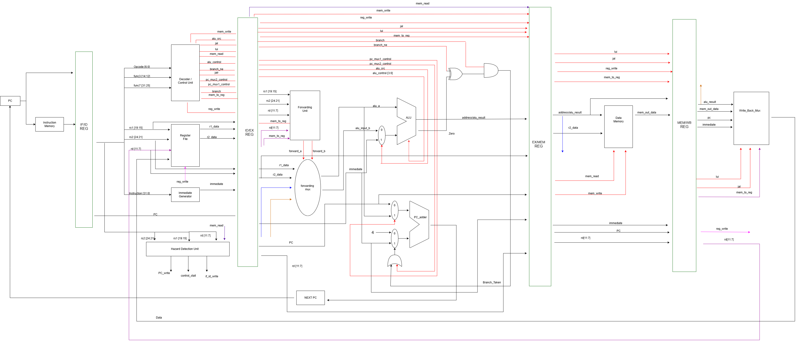

# RISC-V Pipelined Processor

## Overview

This project implements a **32-bit RISC-V pipelined processor** using Verilog HDL.

The processor follows a classic **5-stage pipeline architecture**:

1. Instruction Fetch (IF)
2. Instruction Decode (ID)
3. Execute (EX)
4. Memory Access (MEM)
5. Write Back (WB)

The design supports arithmetic, logical, memory, branch, and jump instructions. Pipeline hazards are handled using **data forwarding** and **control-hazard flushing**.

The processor was developed and verified using a comprehensive simulation testbench covering the supported instruction set and pipeline functionality.

---

## Datapath Diagram

  

> **Note:** For clarity, the datapath diagram does not explicitly show every signal used in the implementation. A few signals are also omitted or not physically connected in the diagram to avoid excessive visual complexity. Signals that carry data from later pipeline stages, particularly those involved in handling control hazards, are represented using the same colour to indicate their logical relationship and data flow, even when their complete connections are not shown.

## Supported Instructions

The current implementation has been verified with the following RISC-V instructions:

| Instruction | Type   | Function                  |
|-------------|--------|---------------------------|
| `ADDI`      | I-type | Add immediate             |
| `ADD`       | R-type | Addition                  |
| `SUB`       | R-type | Subtraction               |
| `AND`       | R-type | Bitwise AND               |
| `OR`        | R-type | Bitwise OR                |
| `XOR`       | R-type | Bitwise XOR               |
| `LW`        | I-type | Load word                 |
| `SW`        | S-type | Store word                |
| `LUI`       | U-type | Load upper immediate      |
| `BEQ`       | B-type | Branch if equal           |
| `BNE`       | B-type | Branch if not equal       |
| `JAL`       | J-type | Jump and link             |
| `JALR`      | I-type | Jump and link register    |

## Data and Control Hazard Handling

A pipelined processor can encounter data hazards when an instruction depends on the result of an earlier instruction.Instead of waiting for the value to reach the register file, the processor uses data forwarding.The forwarding logic determines whether the ALU operands should come from:

00 → Register File

01 → MEM/WB result

10 → EX/MEM result

Branch and jump instructions change the normal sequential flow of execution.When a control-transfer instruction changes the PC, instructions that were fetched from the wrong path must be prevented from modifying the processor state.
The design therefore uses pipeline flushing for control hazards.

The implementation was verified using: BEQ, BNE, JAL, JALR
## Results and Testbench

The testbench file is uploaded along with all the main code files in the file folder and the expected output for the used testbench is uploaded in the docs folder as an image.

## Conclusion

This project demonstrates the implementation of a 5-stage pipelined RISC-V processor in Verilog, including instruction execution, pipeline registers, data forwarding, branch handling, jump handling, memory operations, and register-file timing.

The processor was verified through simulation, and all currently implemented instruction and pipeline tests passed successfully.
